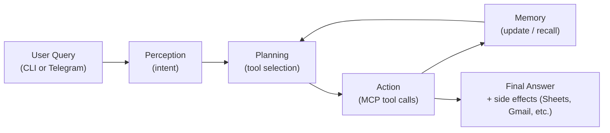

# 🤖 LLM Agents with External APIs & RAG

A modular **Agentic AI framework** that connects Large Language Models (LLMs) to **real-world tools and APIs** – from web search and document parsing to **Google Sheets + Gmail**, plus a **Telegram bot front-end**.

The agent does not just chat, it:

> **Perceives → Plans → Acts → Remembers**

using the **Model Context Protocol (MCP)** to call tools over `stdio` (and later SSE) in a clean, composable way.

---

## 🚀 What this project can do right now

You can run a full end-to-end task starting from **Telegram** or the **CLI**:

> **“Find current F1 driver standings → create a Google Sheet → email me the sheet link.”**
Or any other query like:
> **List 5 popular movies -> create a Google Sheet -> email me the sheet link.**
Or Whatever you want. 

### End-to-end flow (concept)

1. **User** sends a prompt  
   - either in the **terminal** or via **Telegram**:
     > “Find the current F1 driver standings and email me the sheet link.”

2. A **Cortex-style agent**:
   - Interprets the intent
   - Plans a sequence of tool calls
   - Uses several MCP servers

3. MCP servers:
   - Search the web for standings
   - Extract standings data from a live page (e.g. ESPN)
   - Create a **Google Sheet** with the standings
   - Send an **email** containing the sheet link

4. User:
   - Gets a confirmation in Telegram / CLI
   - Sees a new sheet in Google Drive
   - Receives an email with the link at `your_gmail@gmail.com`

---

## 🧠 High-Level Architecture

```mermaid
flowchart TD
    U1["User (CLI)"] --> A["Agent Loop"]
    U2["User (Telegram)"] --> TG["telegram_gateway.py"] --> A

    subgraph Core["Agent Core"]
        A --> P["Perception<br/>(intent detection)"]
        P --> D["Decision & Planning<br/>(strategy)"]
        D --> AC["Action<br/>(MCP tool calls)"]
        AC --> M["Memory<br/>(RAG / FAISS)"]
        M --> D
    end

    AC -->|"MCP (stdio)"| MCP1["Math MCP<br/>(mcp_server_1.py)"]
    AC -->|"MCP (stdio)"| MCP2["Document MCP<br/>(mcp_server_2.py)"]
    AC -->|"MCP (stdio)"| MCP3["Web MCP<br/>(mcp_server_3.py)"]
    AC -->|"MCP (stdio)"| MCPG["GSuite MCP<br/>(mcp_server_gsuite.py)"]
    AC -->|"MCP (stdio)"| MCPT["Telegram MCP<br/>(mcp_server_telegram.py, WIP)"]

    subgraph ExternalAPIs["External APIs"]
        W["Web (DuckDuckGo / HTTP)"]
        GSheets["Google Sheets API"]
        GMail["Gmail API"]
        Tgram["Telegram Bot API"]
    end

    MCP3 --> W
    MCPG --> GSheets
    MCPG --> GMail
    TG --> Tgram
    MCPT --> Tgram
````

* **Agent Core** handles Perception → Planning → Action → Memory.
* **MCP servers** provide typed tools for math, document RAG, web, and Google services.
* **Telegram** currently connects via `telegram_gateway.py` (bot → agent).
  `mcp_server_telegram.py` is available for more advanced / SSE-style integration later.

---

## 🧩 F1 Standings Flow (CLI + Telegram)

### 1. Internal F1 → Sheets → Email pipeline

This is the core flow the agent executes, regardless of where the query starts:

```mermaid
sequenceDiagram
    participant User
    participant Agent
    participant WebMCP as Web MCP (mcp_server_3)
    participant DocsMCP as Docs MCP (mcp_server_2)
    participant GSuiteMCP as GSuite MCP (mcp_server_gsuite)
    participant Sheets as Google Sheets API
    participant Gmail as Gmail API

    User->>Agent: "Find current F1 driver standings and email me the sheet link"
    Agent->>WebMCP: search(query="current F1 standings")
    WebMCP-->>Agent: Top search results (ESPN, F1.com, etc.)

    Agent->>DocsMCP: extract_webpage(url="https://www.espn.com/f1/standings")
    DocsMCP-->>Agent: markdown with standings + points

    Agent->>GSuiteMCP: create_sheet(\n title="F1 Standings from Telegram",\n header=["Pos","Driver","Team","Points"],\n rows=[[1,"Unknown","Unknown","390"], ... ]\n)
    GSuiteMCP->>Sheets: create spreadsheet + write data
    Sheets-->>GSuiteMCP: spreadsheetId, spreadsheetUrl
    GSuiteMCP-->>Agent: spreadsheet_url

    Agent->>GSuiteMCP: send_sheet_link_email(\n to_email="your_gmail@gmail.com",\n subject="F1 Standings Google Sheet Link",\n sheet_url=spreadsheetUrl,\n message="Here is the link..." \n)
    GSuiteMCP->>Gmail: send email with link
    Gmail-->>GSuiteMCP: success
    GSuiteMCP-->>Agent: status=Email sent
    Agent-->>User: Confirms sheet + email sent
```

The Google Sheet rows look like:

| Pos | Driver  | Team    | Points |
| --- | ------- | ------- | ------ |
| 1   | Unknown | Unknown | 390    |
| 2   | Unknown | Unknown | 366    |
| 3   | Unknown | Unknown | 366    |
| 4   | Unknown | Unknown | 294    |
| 5   | Unknown | Unknown | 226    |
| 6   | Unknown | Unknown | 152    |
| 7   | Unknown | Unknown | 137    |
| 8   | Unknown | Unknown | 73     |
| 9   | Unknown | Unknown | 51     |
| 10  | Unknown | Unknown | 49     |

> ⚠ The **points** are scraped live from ESPN. The particular markdown slice returned by the extractor only contains positions and points, not driver or team names, so `Driver` and `Team` are currently filled as `"Unknown"`.

---

### 2. Telegram → Agent part of the story

The Telegram integration adds a friendly entrypoint on top of that pipeline.

#### Components

* `telegram_gateway.py`

  * A small Python script using `python-telegram-bot`
  * Receives user messages from a Telegram bot
  * Forwards the message into the agent as `AGENT_INITIAL_PROMPT`
  * Runs `agent.py` as a subprocess
  * Sends back status updates to the user in Telegram

* `TELEGRAM_BOT_TOKEN` (env var)

  * Bot token created via BotFather
  * Used to authenticate the gateway with Telegram’s Bot API

#### Flow from Telegram

1. You chat with your bot, for example `@own_f1_bot`.

2. You send:

   > `Find the Current Point Standings of F1 Racers.`

3. `telegram_gateway.py` receives this message and:

   * Constructs a rich agent prompt:

     ```text
     Find the Current Point Standings of F1 Racers.

     Then create a Google Sheet named "F1 Standings from Telegram",
     fill it with the positions, drivers, teams, and points, and send
     me the sheet link at your_gmail@gmail.com using your Gmail tools.
     ```

   * Sets this as `AGENT_INITIAL_PROMPT` in the environment

   * Runs:

     ```bash
     python agent.py
     ```

   * Sends an immediate reply in Telegram:

     > Got it! Running the agent now. I’ll email you the Google Sheet link when it’s done.

4. The agent runs exactly the F1 → Sheets → Email flow shown above.

5. When the subprocess finishes, `telegram_gateway.py` sends a final confirmation message:

   > Agent finished running. If everything went well, you should now have a new Google Sheet in Drive and an email with the link. 🚀

6. You:

   * See a new `F1 Standings from Telegram` sheet in Google Drive.
   * Receive an email at `your_gmail@gmail.com` with the sheet link.

---

## 📂 Project Structure

```bash
LLM-Agents-External-APIs/
├── agent.py                  # Main entrypoint (Cortex-R style agent loop)
├── telegram_gateway.py       # Telegram bot → Agent bridge (entrypoint)
│
├── core/
│   ├── context.py            # Shared agent context (state, tools, profile)
│   ├── loop.py               # Per-step loop: Perceive → Plan → Act → Repeat
│   ├── session.py            # Session creation, IDs, metadata
│   └── strategy.py           # System prompts, planning strategy
│
├── modules/
│   ├── perception.py         # Intent detection and high-level task framing
│   ├── decision.py           # Planner – chooses which tools to call
│   ├── action.py             # Executes tool calls, normalizes responses
│   ├── memory.py             # Long-term memory (RAG / FAISS hooks)
│   ├── model_manager.py      # LLM model selection / configuration
│   └── tools.py              # MCP client wiring and tool registry
│
├── config/
│   ├── models.json           # Model configurations (Gemini etc.)
│   └── profiles.yaml         # Agent profiles (step limit, behavior, MCP servers)
│
├── mcp_server_1.py           # Math / utility MCP server (stdio)
├── mcp_server_2.py           # Document RAG MCP server (search + extract)
├── mcp_server_3.py           # Web search + fetch MCP server
├── mcp_server_gsuite.py      # GSuite MCP server (Sheets + Gmail via OAuth)
├── mcp_server_telegram.py    # Telegram MCP server (optional / WIP)
│
├── gsuite_clients.py         # Shared Google Sheets + Gmail client (OAuth)
├── debug_gsuite_direct.py    # Direct test harness for gsuite_clients.py
│
├── pyproject.toml            # Project metadata and dependencies
└── README.md                 # You are here 👋
```

---

## 🔧 Features (Current)

### Agent and MCP

* Multi-step **Perception → Plan → Action → Memory** loop.
* **MCP integration** with multiple servers:

  * Math utilities and sandboxes
  * Document RAG (web pages and PDFs)
  * Web search and content extraction
  * Google Sheets and Gmail
* Configured via `profiles.yaml`:

  * `max_steps`
  * which MCP servers to load
  * profile name, system messages

### Google integration (GSuite MCP)

* **OAuth-based** access to:

  * **Sheets** – create and populate spreadsheets
  * **Gmail** – send emails using your Google account

* Internally uses:

  ```python
  create_or_replace_sheet(title, header, rows)
  send_email_with_sheet_link(to_email, subject, sheet_url, message)
  ```

  wrapped as MCP tools in `mcp_server_gsuite.py`:

  * `create_sheet`
  * `send_sheet_link_email`

### Telegram integration

* Simple, robust **gateway script**:

  ```bash
  uv run telegram_gateway.py
  ```

* Uses env vars:

  ```env
  TELEGRAM_BOT_TOKEN=your_telegram_bot_token
  YOUR_F1_EMAIL=your_gmail@gmail.com   # optional, or hardcoded in script
  ```

* For each incoming message:

  * Builds an `AGENT_INITIAL_PROMPT`
  * Runs `agent.py` as a subprocess
  * Replies in Telegram before and after the agent run

This makes the assignment’s story literal:

> “Send a message to your Agent on Telegram… then something should be stored on a Google Sheet… then this sheet link should be sent to you on Gmail.”

---

## ⚙️ Setup & Running

### 1. Install

```bash
git clone https://github.com/sushant097/LLM-Agents-External-APIs.git
cd LLM-Agents-External-APIs

uv venv
source .venv/bin/activate

uv pip install -e .
```

### 2. Environment variables

Create a `.env` file in the repo root:

```env
# LLM
GEMINI_API_KEY="your_gemini_api_key_here"

# Google OAuth (Sheets + Gmail)
GOOGLE_OAUTH_CLIENT_SECRET_FILE=""

# Telegram bot token (from BotFather)
TELEGRAM_BOT_TOKEN="your_telegram_bot_token_here"
AGENT_INITIAL_PROMPT=""

# Where to send the F1 sheet link
GMAIL_SENDER_EMAIL="your_gmail@gmail.com"
YOUR_F1_EMAIL="your_gmail@gmail.com"
```

### 3. Google OAuth setup

1. In **Google Cloud Console**:

   * Create a project (or use an existing one)
   * Enable **Google Sheets API**
   * Enable **Gmail API**
2. Configure **OAuth consent screen**:

   * External
   * Add your Gmail as a “test user”
3. Create **OAuth client ID**:

   * Application type: Desktop
   * Download the JSON as `gcp-secret.json` to the project root
4. On first run, Google OAuth will:

   * Open a browser window
   * Ask you to sign in and approve Sheets + Gmail scopes
   * Save a `token_gsuite.json` file for reuse

You can test Google setup with:

```bash
uv run debug_gsuite_direct.py
```

You should see:

* A test sheet created in Drive
* An email with the sheet link sent to `your_gmail@gmail.com`

### 4. Run the agent (CLI mode)

```bash
uv run agent.py
```

Example query:

> Find the current F1 driver standings from the web. Then create a Google Sheet called “F1 Standings Agent Test” with columns [Pos, Driver, Team, Points] and fill it with the standings points. After that, email me the Google Sheet link at [your_gmail@gmail.com](mailto:your_gmail@gmail.com) using your Gmail tool.

### 5. Run the Telegram gateway

1. Create a bot with **BotFather** and copy your token.

2. Set `TELEGRAM_BOT_TOKEN` in `.env`.

3. Run:

   ```bash
   uv run telegram_gateway.py
   ```

4. In Telegram:

   * Search for your bot’s username (for example, `@your_f1_agent_bot`)
   * Press **Start**
   * Send:

     > Find the Current Point Standings of F1 Racers.

5. Watch the terminal logs and then:

   * Check Google Drive for `F1 Standings from Telegram`
   * Check `your_gmail@gmail.com` for the sheet link

---

## 🧠 Agent Loop Logic

Conceptually, each run looks like:



For the F1 example, the steps are roughly:

1. `search` (web MCP)
2. `extract_webpage` (documents MCP)
3. `create_sheet` (gsuite MCP)
4. `send_sheet_link_email` (gsuite MCP)
5. Final natural language summary

---

## 🧩 Extending the system

You can extend this framework by:

* Adding new MCP servers:

  * Example: Slack, Notion, Jira, local file system
* Enhancing planning:

  * Different strategies based on profile
* Using SSE for one of the MCP servers:

  * Streaming partial results
  * Live progress updates to the agent

At this point, the core pieces of the assignment are in place:

* Telegram message → agent query
* Agent → web search + parsing
* Agent → Google Sheet creation
* Agent → Gmail with sheet link

All wired through MCP tools and the Cortex-R style loop.